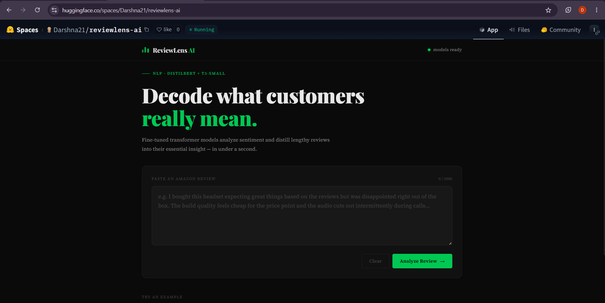
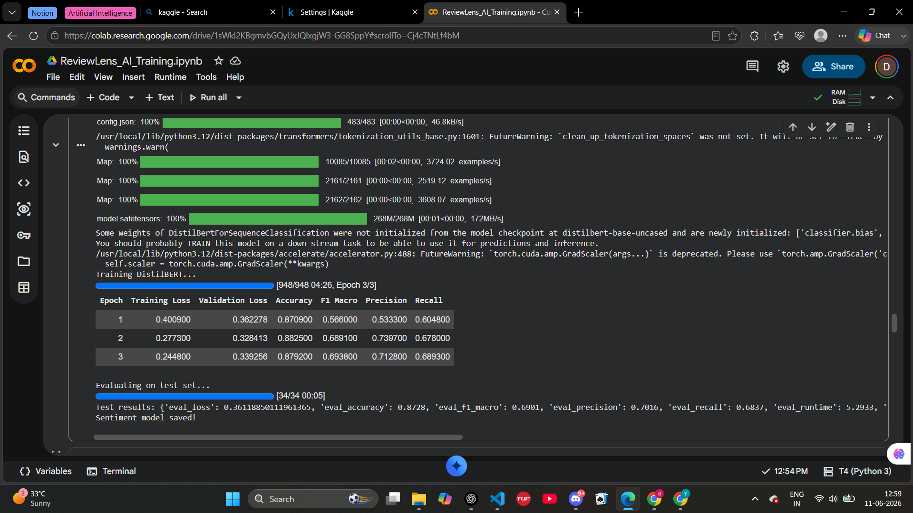
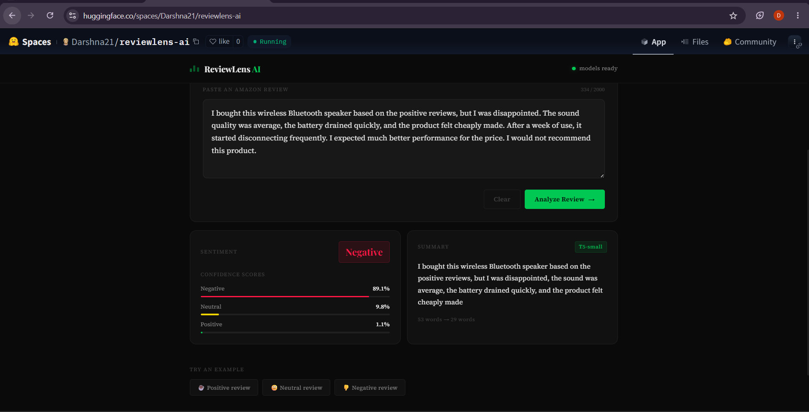

# ReviewLens AI — Amazon Review Intelligence Platform

[](https://huggingface.co/spaces/Darshna21/reviewlens-ai)
[](https://github.com/darshna21-bit/reviewlens-ai)
[](https://python.org)

An end-to-end NLP application that fine-tunes **DistilBERT** for sentiment analysis and **T5-small** for review summarization on Amazon customer reviews, deployed using **Flask, Docker, and Hugging Face Spaces**.

### Key Achievement
- Fine-tuned DistilBERT achieving **87.3% test accuracy**
- Built a complete ML pipeline from training to deployment
- Served predictions through a Flask REST API
- Deployed publicly on Hugging Face Spaces using Docker

## Project Links

- 🚀 **Live Demo** — [ReviewLens AI on Hugging Face](https://huggingface.co/spaces/Darshna21/reviewlens-ai)
- 📂 **Source Code** — [GitHub Repository](https://github.com/darshna21-bit/reviewlens-ai)
- 📓 **Training Notebook** — [Google Colab Notebook](https://colab.research.google.com/drive/1sWkI2KBgmvbGQyUxJQIxgjW3-GG8SppY?usp=sharing)

---

## Application Preview

<table>
<tr>
<td align="center">
<b>Landing Page & Review Input</b><br>

</td>

<td align="center">
<b>Model Training & Evaluation</b><br>

</td>
</tr>

<tr>
<td align="center">
<b>Positive Review Analysis</b><br>

</td>

<td align="center">
<b>Negative Review Analysis</b><br>

</td>
</tr>
</table>

---

## Features

- 3-class sentiment classification (Positive / Neutral / Negative)
- Confidence score visualization
- AI-powered review summarization
- Fine-tuned transformer models
- REST API architecture
- Docker deployment
- Hugging Face hosting

---

## Dataset

**Amazon Fine Food Reviews Dataset**

- 15,000 reviews used for training
- 70 / 15 / 15 train-validation-test split
- Star ratings converted into sentiment classes

| Rating | Label |
|----------|----------|
| 1–2 | Negative |
| 3 | Neutral |
| 4–5 | Positive |

For summarization, review headlines were used as target summaries.

---

## Model Architecture

```text
Amazon Review
      │
      ▼
 Flask REST API
      │
 ┌─────────────┐
 │ DistilBERT  │
 └─────────────┘
      │
 Sentiment + Confidence
      │
 ┌─────────────┐
 │  T5-small   │
 └─────────────┘
      │
 Generated Summary
      ▼
     UI
```

---

## Model Performance

### Sentiment Classification

| Metric | Score |
|----------|----------|
| Accuracy | 87.3% |
| Precision | 70.2% |
| Recall | 68.4% |
| Macro F1 | 69.0% |

### Summarization

| Metric | Score |
|----------|----------|
| ROUGE-1 | 0.31 |
| ROUGE-2 | 0.14 |
| ROUGE-L | 0.28 |

---

## Tech Stack

| Component | Technology |
|------------|------------|
| Sentiment Analysis | DistilBERT |
| Summarization | T5-small |
| Framework | PyTorch, Transformers |
| Backend | Flask |
| Frontend | HTML, CSS, JavaScript |
| Training | Google Colab T4 GPU |
| Deployment | Docker, Hugging Face Spaces |

---

## Challenges & Learnings

- Handling class imbalance using Macro F1 instead of accuracy alone
- Fine-tuning transformer models on limited compute resources
- Optimizing inference for CPU deployment
- Understanding T5 task-prefix behavior for summarization

---

## Run Locally

```bash
git clone https://github.com/darshna21-bit/reviewlens-ai.git
cd reviewlens-ai
pip install -r requirements.txt
python app.py
```

Run tests:

```bash
pytest tests/ -v
```

---

## Deployment

The application is containerized using Docker and deployed on Hugging Face Spaces with a custom Flask backend.

---

**Built by Darshna Shingavi**  
Third-Year Computer Engineering Student
